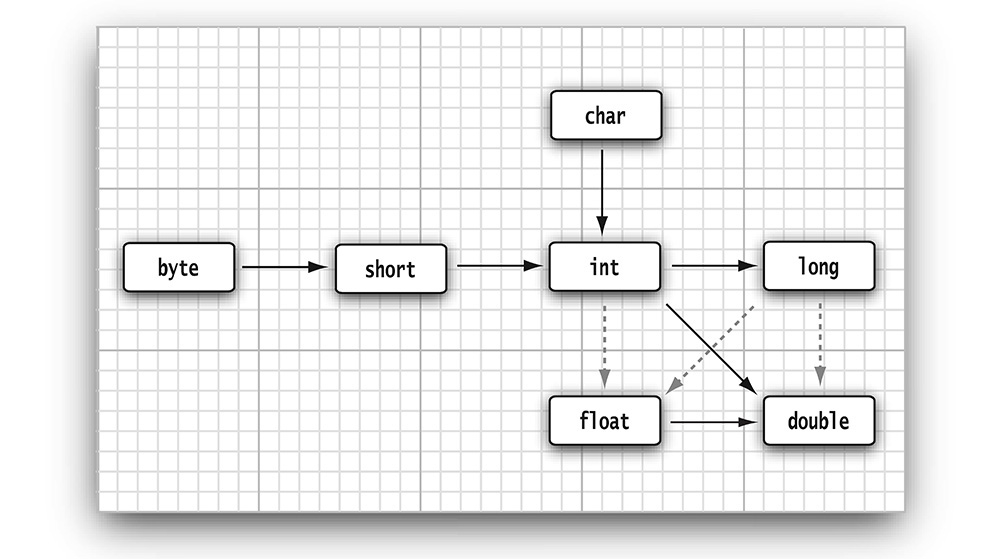

# Basics 
## Fundamentals
### Data Types
#### Integer Types
| Type | Size | Range |
|-|-|-|
| int | 4 bytes |  -2 147 483 648 (-2<sup>31</sup>) to +2 147 483 647 |
| short | 2 bytes | -32 768 (-2<sup>15</sup>) to +32 767 |
| long | 8 types | -9 223 372 036 854 775 808 (-2<sup>63</sup>) to +9 223 372 036 854 775 807 |
| byte | 1 byte | -128 (-2<sup>7</sup>) to +127 |

#### Floating Point Types
* Numbers of `float` needs to be suffixed by either `F` or `f`, else type would be considered as `double`
* Numbers of `double` can be suffixed by either `D` or `d`

| Type | Size | Range |
|-|-|-|
| float | 4 bytes | approximately ±3.40282347E+38F (6-7 significant decimal digits) Java implements IEEE 754 standard |
| double | 8 bytes | approximately ±1.79769313486231570E+308
(15 significant decimal digits) |

> **Note:** floating point numbers are NOT stored exactly. For example, '0.9' is stored as '0.8999999999999999'

> **Note:** methods tagged with the `strictfp` keyword must use strict floating-point operations that yield reproducible results. <br/>
For Example:
```java
public static strictfp void main (String args[]) { ... }
```

#### Char Types
* Unicode values are represented by prefixing `\u`
* Some special characters are prefixed by `\ (backslash)`
| Type | Size |
|-|-|
| char | 2 bytes, not necessarily always 2 bytes|
> **Note:** 
* In the case of encodings, it would be 1 byte or for most common characters.  
* Since the platform default encoding is usually a 1-byte encoding such as ISO-8859-1 or a variable-length encoding such as UTF-8, it can easily convert that 1 byte to a single character.

#### Boolean Type
* `boolean` type has two values, `false` and `true`
* Non Zero Value ==> true

#### Variables
* eligible characters are 'A–Z', 'a–z', '_', '$', But '$' is not suggested use, as *It is intended for names that are generated by the **Java compiler** and other tools*.

```java
int i;
System.out.println(i); // ERROR- variable NOT initialized
```

### Operators
#### Math.*
* `Math` class provides mathematical functions and constants.  For example
  * sqrt(x)
  * pow(x, 2) - x<sup>2</sup>
  * floorMod(x, 12) - return 0 to 11
  * Math.sin
  * Math.cos
  * Math.tan
  * Math.atan
  * Math.atan2
  * Math.exp
  * Math.log
  * Math.log10
  * Math.PI - CONSTANTS
  * Math.E - CONSTANTS

* If you add `import static java.lang.Math.*`, we could use the functions directly like `sqrt(64)` instead of `java.lang.Math.sqrt(64)`

#### Type Conversions b/w Numeric

* dashed lines means information would be lost during conversion

```java
int n = 123456789;
float f = n; // f is 1.23456792E8
```

* When two values are combined with a binary operator (such as `n + f` where `n` is an integer and `f` is a floating-point value), both operands are converted to a common type before the operation is carried out.

order | n or f data type | n + f data type
--|--|--
1 | double | double
2 | float | float
3 | long | long
4 | int | int

#### Casts
* `int` values are changed to `double` or `float` as it is necessary
* sometimes, need either `double` or `float` to `long` or `int`, then some information would be lost
```java
float f = 9.998;
int i = (int) f; // i would be 9, as precision would be ignored during casting
int i = (int) Math.round(f); //i would be 10
```

#### Combining Assignment and Operators
* `x+=4` means `x = x + 4`
* What about `x += 3.5` and `x` is other type say `int`?
  * `x = (int)(x + 3.5)`

#### Increment and Decrement Operators
* `x++` (post) or `++x` (pre) and `x--` or `--x`
````java
int m = 7;
int n = 7;
int a = 2 * ++m; // now a is 16, m is 8
int b = 2 * n++; // now b is 14, n is 8
````

#### Relational and Boolean operators
* `==`
* `!=`
* `&&`
* `||`
* `cond ? expr : expr`

#### Bitwise operators
* `&` (and)
* `|` (or)
* `^` (xor) 
* `~` (not)
* `>>`
* `<<`
* `>>>` operator fills the top bits with zero, unlike `>>` which extends the sign bit into the top bits. There is no `<<<` operator.

#### Parentheses and Operator Hierarchy
Level |	Operator | Associativity
--|--|--
16 | `[]` `.` `()`	| left to right
15 | `++ (post)` `-- (post)` | not associative
14 | `++ (pre)` `-- (pre)` `+` `-` `!` `~` | right to left
13 | `() new	cast object creation` | right to left
12 | `*` `/` `%` | left to right
11 | `+` `- `+ (string concatenation)` | left to right