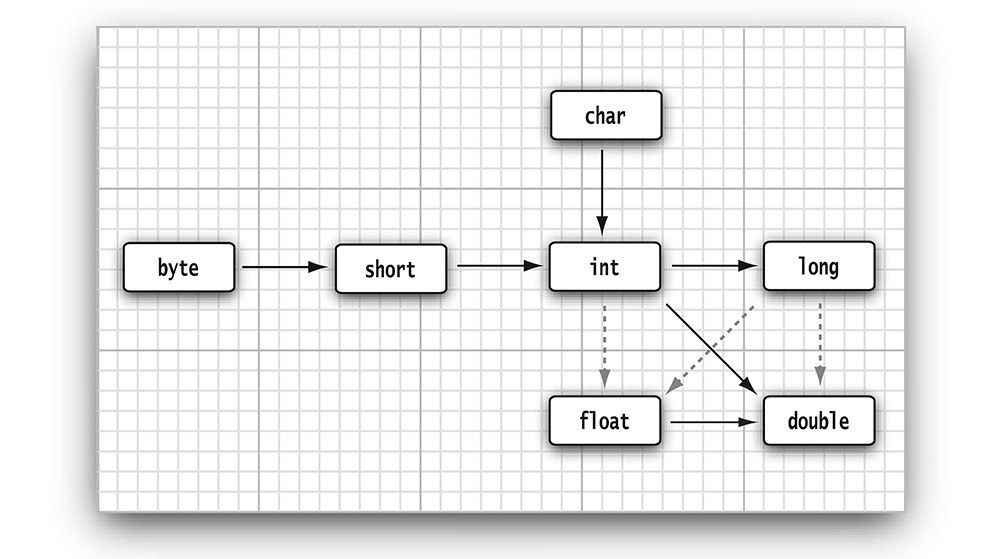

### Operators
#### Math.*
* `Math` class provides mathematical functions and constants.  For example
  * sqrt(x)
  * pow(x, 2) - x<sup>2</sup>
  * floorMod(x, 12) - return 0 to 11
  * Math.sin
  * Math.cos
  * Math.tan
  * Math.atan
  * Math.atan2
  * Math.exp
  * Math.log
  * Math.log10
  * Math.PI - CONSTANTS
  * Math.E - CONSTANTS

* If you add `import static java.lang.Math.*`, we could use the functions directly like `sqrt(64)` instead of `java.lang.Math.sqrt(64)`

#### Type Conversions b/w Numeric

* dashed lines means information would be lost during conversion

```java
int n = 123456789;
float f = n; // f is 1.23456792E8
```

* When two values are combined with a binary operator (such as `n + f` where `n` is an integer and `f` is a floating-point value), both operands are converted to a common type before the operation is carried out.

order | n or f data type | n + f data type
--|--|--
1 | double | double
2 | float | float
3 | long | long
4 | int | int

#### Casts
* `int` values are changed to `double` or `float` as it is necessary
* sometimes, need either `double` or `float` to `long` or `int`, then some information would be lost
```java
float f = 9.998;
int i = (int) f; // i would be 9, as precision would be ignored during casting
int i = (int) Math.round(f); //i would be 10
```

#### Combining Assignment and Operators
* `x+=4` means `x = x + 4`
* What about `x += 3.5` and `x` is other type say `int`?
  * `x = (int)(x + 3.5)`

#### Increment and Decrement Operators
* `x++` (post) or `++x` (pre) and `x--` or `--x`
````java
int m = 7;
int n = 7;
int a = 2 * ++m; // now a is 16, m is 8
int b = 2 * n++; // now b is 14, n is 8
````

#### Relational and Boolean operators
* `==`
* `!=`
* `&&`
* `||`
* `cond ? expr : expr`

#### Bitwise operators
* `&` (and)
* `|` (or)
* `^` (xor) 
* `~` (not)
* `>>`
* `<<`
* `>>>` operator fills the top bits with zero, unlike `>>` which extends the sign bit into the top bits. There is no `<<<` operator.

#### Parentheses and Operator Hierarchy
Level |	Operator | Associativity
--|--|--
16 | `[]` `.` `()`	| left to right
15 | `++ (post)` `-- (post)` | not associative
14 | `++ (pre)` `-- (pre)` `+` `-` `!` `~` | right to left
13 | `() new	cast object creation` | right to left
12 | `*` `/` `%` | left to right
11 | `+` `- `+ (string concatenation)` | left to right
10 | `<<` `>>` `>>>`  | left to right
9 | `<` `<=` `>` `>=` `instanceof`  | not associative
8 | `==` `!=` | left to right
7 | `&`  bitwise AND | left to right
6 | `^`  bitwise XOR | left to right
5 | `&#124;`  bitwise OR | left to right
4 | `&&`  logical AND | left to right
3 | `&#124;&#124;`  logical OR | left to right
2 | `?:`  ternary | right to left
1 | `=` `+=` `-=` `*=` `/=` `%=` `&=` `^=` `|=`  `<<=`  `>>=` `>>>=` | right to left

#### Enumerated Type
* you can define your own enum type whenever it is needed
```java
enum PizzaSize { SMALL, MEDIUM, LARGE, EXTRA_LARGE };
```
