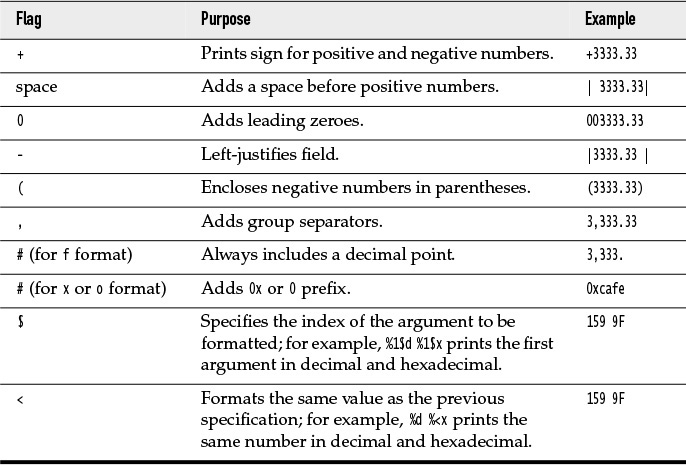

### Input And Output
#### Reading Input
* Input from the console would be read by `java.util.Scanner` by using `System.in`, `Scanner` reads the input from `java.lang.System.in` and provides various functions to read.
    * nextLine
    * nextInt
    * next - read next word (whitespace as delimiter)
    * hasNext
    * check API for whole list
* `Scanner` could read from various inputs like File, InputStream, Path, Readable and so on
```java
// read from console
Scanner scan = new Scanner(System.in);

// read from file
Scanner in = new Scanner(Paths.get("myfile.txt"), "UTF-8");
```
* What about password?
    * `Scanner` reads as characters and those are visible, `Scanner` is not the best option to read passwords
    * `java.io.Console` could read the password from `java.lang.System`
    ```java
    Console cons = System.console();
    String username = cons.readLine("User name: ");
    char[] passwd = cons.readPassword("Password: ");
    ```
* How to write to a file?
    * Using `PrintWriter`
    * If not exist, it would get created
    ```java
    PrintWriter out = new PrintWriter("myfile.txt", "UTF-8");
    ```

#### Formatting Output
* `System.out.printf` method formats the output like in C programming



